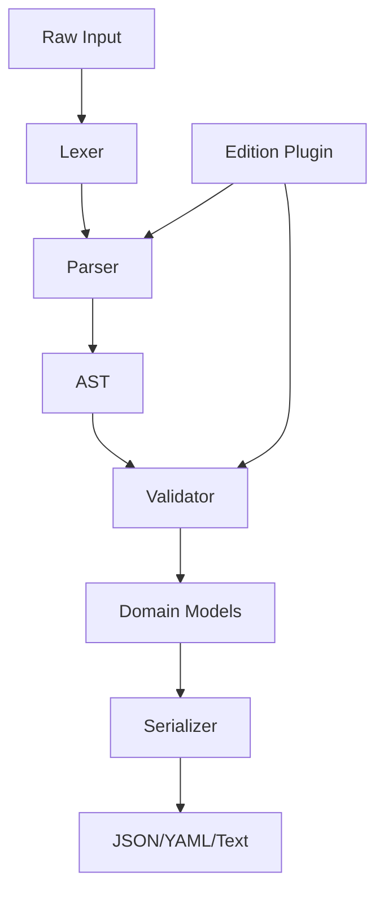

# WARScribe-Core Architecture

> Agent context artifact for understanding the notation engine structure.

## Purpose

Edition-agnostic action notation engine for Warhammer tabletop games. Provides the canonical parser and serializer for game transcripts across the platform.

## Technology Stack

- **Language**: Python 3.11+
- **Parser**: Lark grammar-based
- **Validation**: Pydantic models
- **Testing**: Pytest with property-based tests

## Directory Structure

```
├── src/warscribe_core/
│   ├── grammar/        # Lark grammar definitions
│   ├── models/         # Pydantic domain models
│   ├── parser/         # Parser implementation
│   ├── serializer/     # Output formatters
│   └── plugins/        # Edition-specific plugins
├── tests/              # Test suites
└── GRAMMAR.md          # Canonical notation specification
```

## Component Graph



## Integration Points

| Consumer        | Method        | Notes             |
| --------------- | ------------- | ----------------- |
| Vindicta-Portal | npm package   | WebAssembly build |
| Meta-Oracle     | Python import | Direct dependency |
| Primordia-AI    | Python import | State encoding    |
| Vindicta-API    | Python import | Validation layer  |

## Grammar Reference

See [GRAMMAR.md](../GRAMMAR.md) for the canonical notation specification.
All parsers must pass the conformance test suite.
